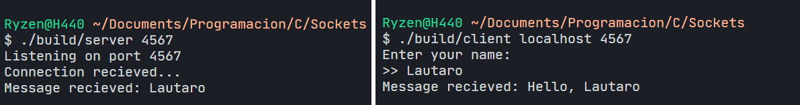

# Learning Sockets

Create sockets, send and receive data.



## How to build

### Requirements
- GNU Make
- GNU GCC

```powershell
PS> make [all | client | server | clean]
```
> Note: `$ make` defaults to `$ make all`

## How to run

### Client
```powershell
PS> .\build\client.exe <hostname> <port>
```

### Server
```powershell
PS> .\build\server.exe <port>
```

---

### Notes

This project was built using `cygwin` on **Windows 10**. Linux users should check the `make` file in order to set the appropriate `include` path, file paths and appropriate flags.
